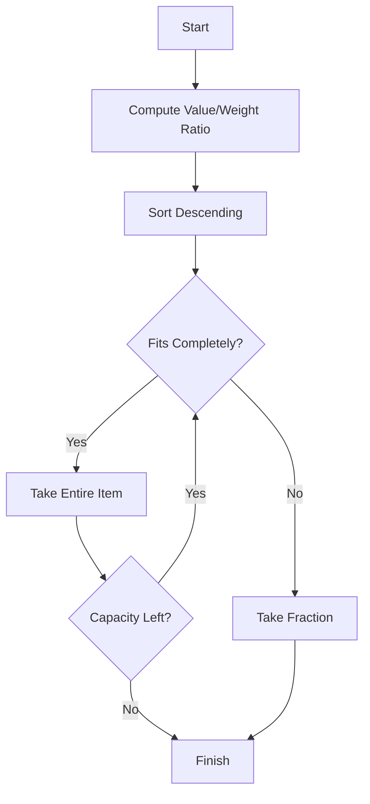

# Greedy – Fractional Knapsack Problem Study Guide

## Table of Contents
- [Why Fractional Knapsack Problem Matters](#why-fractional-knapsack-problem-matters)
- [When to Use It](#when-to-use-it)
- [Where It's Used](#where-its-used)
- [How to Approach It](#how-to-approach-it)
- [Algorithm Explanation](#algorithm-explanation)
- [Visual Explanations](#visual-explanations)
- [Limitations](#limitations)
- [Edge Cases](#edge-cases)
- [Algorithmic Code – Java](#algorithmic-code--java)
- [Complexity Analysis](#complexity-analysis)

---

# Why Fractional Knapsack Problem Matters

The Fractional Knapsack Problem is a classic **Greedy Algorithm** problem where items can be divided into smaller parts.

**Goal:** Maximize the total value placed inside a knapsack with limited capacity.

Unlike the 0/1 Knapsack Problem, an item **does not need to be taken completely**.

## Real-world Applications

- Cargo loading
- Investment allocation
- Cloud resource allocation
- Memory allocation
- Bandwidth distribution

---

# When to Use It

Use Fractional Knapsack when:

- Items are divisible.
- Maximum value is required.
- Partial selection is allowed.
- Greedy choice based on value/weight ratio is valid.

Do **not** use it when items cannot be split.

---

# Where It's Used

| Domain | Example |
|---------|----------|
| Logistics | Cargo loading |
| Finance | Investment distribution |
| Cloud Computing | CPU allocation |
| Manufacturing | Raw material usage |
| Networking | Bandwidth sharing |

---

# How to Approach It

1. Compute value/weight ratio.
2. Sort ratios in descending order.
3. Pick highest ratio first.
4. Take complete item if possible.
5. Otherwise take only required fraction.
6. Stop when capacity becomes zero.

## Why Greedy Works

Selecting the highest value per unit weight first always leaves maximum opportunity for future selections because every unit of remaining capacity is used most efficiently.

---

# Algorithm Explanation

```text
Input:
Items (value, weight)
Capacity W

Compute ratio = value/weight

Sort by ratio decreasing

for each item
    if weight <= remaining capacity
         take complete item
    else
         take fraction
         stop
```

---

# Visual Explanations

## Greedy Flow



## Example

Capacity = 50

|Item|Value|Weight|Ratio|
|---|---:|---:|---:|
|A|60|10|6|
|B|100|20|5|
|C|120|30|4|

Selection

```text
Capacity = 50

Take A (10)
Remaining = 40

Take B (20)
Remaining = 20

Take 20/30 of C

Total Value
=60+100+120×20/30
=240
```

## ASCII Illustration

```text
Capacity

|==============================|

Take A
|AAAAAA========================|

Take B
|AAAAAABBBBBBBBBBBB============|

Take 2/3 of C
|AAAAAABBBBBBBBBBBBCCCCCCCC====|
```

## Comparison with 0/1 Knapsack

|Feature|Fractional|0/1|
|-------|----------|---|
|Partial item|Yes|No|
|Greedy works|Yes|No|
|Optimal using Greedy|Yes|No|
|Typical Solution|Sorting|Dynamic Programming|

---

# Limitations

- Works only when items are divisible.
- Cannot solve 0/1 Knapsack optimally.

Example:

Capacity = 50

|Item|Value|Weight|
|---|---:|---:|
|A|60|10|
|B|100|20|
|C|120|30|

Fractional:
Take 2/3 of C → Optimal.

0/1:
Cannot split C.

---

# Edge Cases

|Case|Handling|
|----|--------|
|Capacity = 0|Return 0|
|No items|Return 0|
|Item heavier than capacity|Take fraction|
|Zero weight & positive value|Treat specially; avoid division by zero|
|Negative value|Ignore in practical implementations|
|Negative weight|Invalid input|

Example:

```text
Capacity = 0

Result = 0
```

---

# Algorithmic Code – Java

```java
import java.util.*;

class Item {
    int value;
    int weight;
    double ratio;

    Item(int value, int weight) {
        this.value = value;
        this.weight = weight;

        if (weight == 0)
            ratio = Double.POSITIVE_INFINITY;
        else
            ratio = (double) value / weight;
    }
}

public class FractionalKnapsack {

    static double fractionalKnapsack(int capacity, Item[] items) {

        Arrays.sort(items,
                (a, b) -> Double.compare(b.ratio, a.ratio));

        double totalValue = 0.0;

        for (Item item : items) {

            if (item.weight <= 0) {
                if (item.value > 0)
                    totalValue += item.value;
                continue;
            }

            if (capacity == 0)
                break;

            if (item.weight <= capacity) {

                capacity -= item.weight;
                totalValue += item.value;

            } else {

                double fraction =
                        (double) capacity / item.weight;

                totalValue += item.value * fraction;

                capacity = 0;
            }
        }

        return totalValue;
    }

    public static void main(String[] args) {

        Item[] items = {
                new Item(60,10),
                new Item(100,20),
                new Item(120,30)
        };

        int capacity = 50;

        System.out.println(
                "Maximum Value = " +
                fractionalKnapsack(capacity, items)
        );

        Item[] test2 = {
                new Item(500,0),
                new Item(50,25)
        };

        System.out.println(
                "Edge Case = " +
                fractionalKnapsack(10,test2)
        );
    }
}
```

---

# Complexity Analysis

|Operation|Complexity|
|---------|----------|
|Compute ratios|O(n)|
|Sorting|O(n log n)|
|Traversal|O(n)|

## Overall Time Complexity

**O(n log n)**

Sorting dominates.

## Space Complexity

- Extra space (excluding input): **O(1)** if sorting in-place (implementation dependent).
- Practical Java sort on object arrays may use additional memory internally.

---

## Exam Tips

- Always sort by **value/weight ratio**.
- Fractional Knapsack is one of the few problems where the greedy strategy is provably optimal.
- Remember the distinction from the 0/1 Knapsack Problem: **fractional selection makes the greedy approach valid**.
