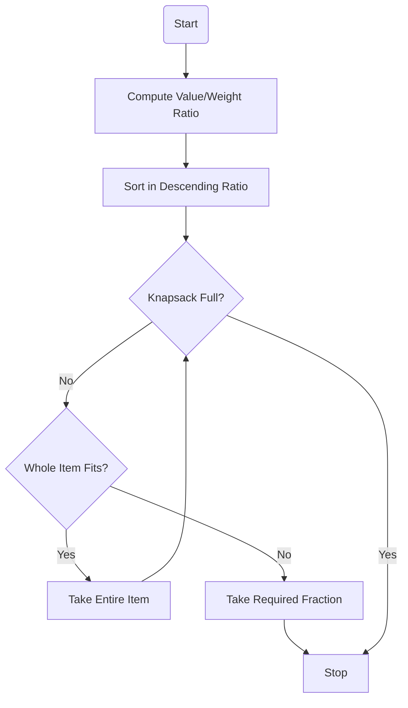
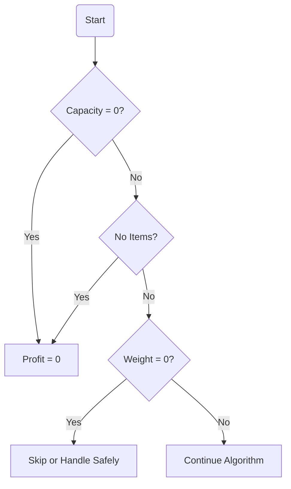

# Greedy Algorithm – Fractional Knapsack Problem

> **Design and Analysis of Algorithms (DAA) – Engineering Exam Notes**

---

# Table of Contents

* [Why Fractional Knapsack Problem Matters](#why-fractional-knapsack-problem-matters)
* [When to Use It](#when-to-use-it)
* [Where It's Used](#where-its-used)
* [How to Approach It](#how-to-approach-it)
* [Algorithm Explanation](#algorithm-explanation)
* [Visual Explanations](#visual-explanations)
* [Limitations](#limitations)
* [Edge Cases](#edge-cases)
* [Algorithmic Code – Java](#algorithmic-code--java)
* [Complexity Analysis](#complexity-analysis)
* [Exam Revision Summary](#exam-revision-summary)

---

# Why Fractional Knapsack Problem Matters

The **Fractional Knapsack Problem** is one of the most important applications of the **Greedy Algorithm**.

It teaches an important algorithmic principle:

> **Choose the locally best option first to achieve the globally optimal solution.**

Unlike the **0/1 Knapsack Problem**, an item can be divided into smaller parts. This makes the greedy strategy produce the optimal answer.

## Objective

Given:

* Items with **Weight**
* Items with **Value**
* Knapsack Capacity **W**

Find the **maximum value** that can be carried.

Since items are divisible, we may take:

* Entire item
* Half item
* Quarter item
* Any fraction

---

# When to Use It

Use Fractional Knapsack whenever:

* Items are divisible
* Profit is proportional to quantity taken
* Goal is maximizing value
* Greedy choice is valid

## Suitable Situations

| Scenario                     | Applicable |
| ---------------------------- | ---------- |
| Gold pieces                  | Yes        |
| Oil transport                | Yes        |
| Grain storage                | Yes        |
| Milk distribution            | Yes        |
| Water allocation             | Yes        |
| Digital bandwidth allocation | Yes        |

---

# Where It's Used

Fractional Knapsack appears in many optimization problems.

| Domain              | Example                 |
| ------------------- | ----------------------- |
| Logistics           | Load cargo partially    |
| Banking             | Portfolio allocation    |
| Cloud Computing     | Allocate CPU resources  |
| Networking          | Bandwidth allocation    |
| Manufacturing       | Raw material allocation |
| Supply Chain        | Transport optimization  |
| Resource Scheduling | Budget distribution     |

---

# How to Approach It

## Greedy Strategy

Instead of choosing the item with:

* Maximum value
* Minimum weight

Choose the item with the:

> **Highest Value / Weight Ratio**

---

## Why?

Because every unit of weight should generate the maximum possible profit.

Example:

| Item | Value | Weight | Ratio |
| ---- | ----: | -----: | ----: |
| A    |    60 |     10 |     6 |
| B    |   100 |     20 |     5 |
| C    |   120 |     30 |     4 |

Greedy order:

```
A → B → C
```

Take highest ratio first.

---

## Greedy Decision Flow



---

# Algorithm Explanation

## Step 1

Calculate:

```
Ratio = Value / Weight
```

---

## Step 2

Sort items in decreasing order.

Example:

| Item | Ratio |
| ---- | ----: |
| A    |     6 |
| B    |     5 |
| C    |     4 |

---

## Step 3

Traverse sorted items.

If entire item fits:

```
Take Complete Item
```

Otherwise:

```
Take Required Fraction
```

---

## Step 4

Update:

```
Remaining Capacity

Total Profit
```

Continue until knapsack becomes full.

---

# Visual Explanations

## Worked Example

Capacity = **50**

| Item | Value | Weight | Ratio |
| ---- | ----: | -----: | ----: |
| A    |    60 |     10 |     6 |
| B    |   100 |     20 |     5 |
| C    |   120 |     30 |     4 |

---

### Step 1

Take Item A

```
Capacity

[##########........................................]

Used = 10

Profit = 60
```

Remaining Capacity = 40

---

### Step 2

Take Item B

```
Capacity

[##############################....................]

Used = 30

Profit = 160
```

Remaining Capacity = 20

---

### Step 3

Only 20 capacity remains.

Item C weight = 30

Take:

```
20/30 = 2/3
```

Fraction taken:

```
████████████████████░░░░░░░░░
```

Value gained:

```
120 × (20/30)

= 80
```

Final Profit:

```
60 + 100 + 80

= 240
```

---

## Complete Execution Table

| Step | Item | Action | Capacity Left | Profit |
| ---- | ---- | ------ | ------------: | -----: |
| 1    | A    | Full   |            40 |     60 |
| 2    | B    | Full   |            20 |    160 |
| 3    | C    | 2/3    |             0 |    240 |

---

## Greedy Selection Visualization

```
Highest Ratio

A (6)

↓

B (5)

↓

C (4)

↓

Maximum Profit
```

---

## Fraction Visualization

```
Item C

+------------------------------+

████████████████████░░░░░░░░░░

Taken = 2/3

Ignored = 1/3

+------------------------------+
```

---

## Comparison with 0/1 Knapsack

| Feature                    | Fractional | 0/1   |
| -------------------------- | ---------- | ----- |
| Item Division              | Yes        | No    |
| Greedy Works               | Yes        | No    |
| Dynamic Programming Needed | No         | Yes   |
| Optimal by Greedy          | Yes        | No    |
| Time Complexity            | O(n log n) | O(nW) |

---

### Visual Comparison

```
Fractional

Item

████████████████████

↓

Take

████████████░░░░░░░


0/1

Item

████████████████████

↓

Take ALL

or

Take NOTHING
```

---

# Limitations

Fractional Knapsack only works when items are divisible.

---

## Example

Capacity = 50

| Item   | Weight | Value |
| ------ | ------ | ----- |
| Laptop | 40     | 200   |
| TV     | 30     | 180   |

You **cannot** take:

```
Half Laptop

or

30% Television
```

Greedy fails.

---

## Visual

```
Fractional

████████████

↓

██████░░░░░


0/1

████████████

↓

Take Entire

or

Leave Entire
```

---

## Where It Doesn't Apply

* Books
* Cars
* Mobile Phones
* Laptops
* Furniture
* Human Resources
* Project Selection

---

# Edge Cases

## 1. Empty Knapsack

Capacity = 0

```
Nothing fits.

Profit = 0
```

---

## 2. No Items

```
Items = []

Profit = 0
```

---

## 3. All Items Too Large

Still works because fractions are allowed.

Example

Capacity = 10

Item Weight = 100

```
Take 10%

Done
```

---

## 4. Zero Weight

```
Weight = 0

Ratio = Undefined
```

Must avoid division by zero.

---

## 5. Negative Value

```
Value = -20
```

Ignore such items because they decrease total profit.

---

## 6. Very Large Capacity

If capacity exceeds total weight:

```
Take every item.

Profit = Sum of Values
```

---

## Edge Case Flowchart



---

# Algorithmic Code – Java

```java
import java.util.Arrays;
import java.util.Comparator;

class Item {
    int value;
    int weight;

    Item(int value, int weight) {
        this.value = value;
        this.weight = weight;
    }

    double ratio() {
        return (double) value / weight;
    }
}

public class FractionalKnapsack {

    public static double getMaximumValue(Item[] items, int capacity) {

        // Sort items by value-to-weight ratio (descending)
        Arrays.sort(items, new Comparator<Item>() {
            @Override
            public int compare(Item a, Item b) {
                return Double.compare(b.ratio(), a.ratio());
            }
        });

        double totalValue = 0.0;

        for (Item item : items) {

            // Skip invalid items
            if (item.weight <= 0 || item.value <= 0)
                continue;

            // Entire item fits
            if (capacity >= item.weight) {
                capacity -= item.weight;
                totalValue += item.value;
            }

            // Take fraction
            else {
                double fraction = (double) capacity / item.weight;
                totalValue += item.value * fraction;
                capacity = 0;
                break;
            }
        }

        return totalValue;
    }

    public static void main(String[] args) {

        Item[] items = {
                new Item(60, 10),
                new Item(100, 20),
                new Item(120, 30)
        };

        int capacity = 50;

        double result = getMaximumValue(items, capacity);

        System.out.println("Maximum Profit = " + result);

        // Additional test cases
        Item[] test2 = {
                new Item(500, 30),
                new Item(400, 20),
                new Item(200, 10)
        };

        System.out.println(
                "Maximum Profit = " +
                getMaximumValue(test2, 40));

        Item[] empty = {};

        System.out.println(
                "Maximum Profit = " +
                getMaximumValue(empty, 50));

        Item[] zeroCapacity = {
                new Item(60, 10)
        };

        System.out.println(
                "Maximum Profit = " +
                getMaximumValue(zeroCapacity, 0));
    }
}
```

---

# Complexity Analysis

## Time Complexity

### Ratio Calculation

```
O(n)
```

---

### Sorting

```
O(n log n)
```

---

### Traversing Items

```
O(n)
```

---

### Total

```
O(n log n)
```

Sorting dominates the running time.

---

## Space Complexity

Sorting is performed on the array.

Extra variables used:

* Total Profit
* Capacity
* Fraction

Overall:

```
O(1)
```

If the sorting implementation requires auxiliary memory, practical implementations may use **O(log n)** stack space internally.

---

# Exam Revision Summary

## Remember These Points

* Fractional Knapsack uses a **Greedy Algorithm**.
* Select items in **descending Value/Weight ratio**.
* Items **can be divided**.
* Greedy gives the **optimal solution**.
* Main steps:

  1. Compute ratio.
  2. Sort by ratio.
  3. Pick full items while possible.
  4. Take a fraction of the next item if needed.
* **Time Complexity:** `O(n log n)`
* **Space Complexity:** `O(1)` (excluding sorting overhead)

---

## Quick Memory Trick

```
Compute Ratio
      ↓
Sort Ratios
      ↓
Take Best Item
      ↓
Repeat
      ↓
Take Fraction
      ↓
Maximum Profit
```
