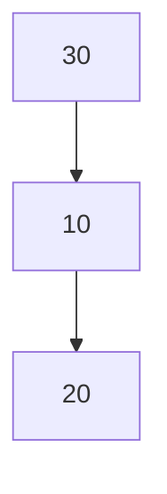
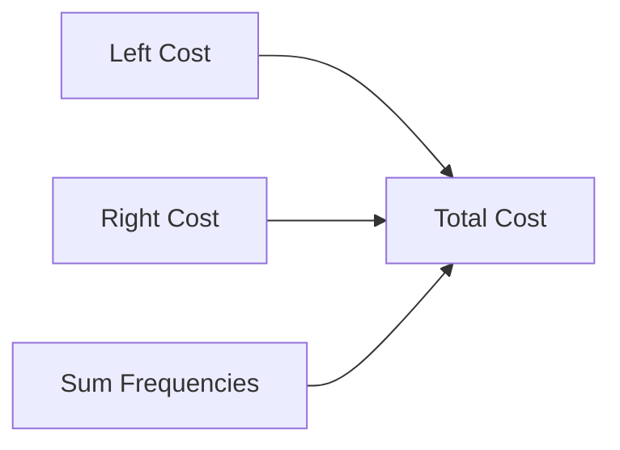

# Optimal Binary Search Trees (Dynamic Programming)

## Table of Contents
- [1. Introduction](#1-introduction)
- [2. Why, When and Where](#2-why-when-and-where)
- [3. Intuition](#3-intuition)
- [4. Dynamic Programming Idea](#4-dynamic-programming-idea)
- [5. Worked Example](#5-worked-example)
- [6. Mermaid Visuals](#6-mermaid-visuals)
- [7. Java Implementation](#7-java-implementation)
- [8. Complexity](#8-complexity)
- [9. Limitations & Edge Cases](#9-limitations--edge-cases)
- [10. Summary](#10-summary)
- [11. Exam Tips](#11-exam-tips)

# 1. Introduction

An **Optimal Binary Search Tree (OBST)** is a Binary Search Tree that minimizes the expected search cost when each key has a known search frequency (or probability).

Instead of minimizing height, it minimizes the **weighted search cost**.

---

# 2. Why, When and Where

## Why?

Different keys are searched different numbers of times.

Example:

|Key|Frequency|
|---|---:|
|10|34|
|20|8|
|30|50|

Placing key **30** near the root reduces average search cost.

---

## When?

Use when:

- Keys are sorted.
- Search frequencies are known.
- Tree is mostly static.
- Search efficiency matters more than insertion/deletion.

---

## Where?

Applications:

- Compiler symbol tables
- Database indexes
- Dictionary lookup
- Read-only search structures
- Embedded lookup tables

---

# 3. Intuition

If every key is searched equally:

```
Balanced BST
```

If one key is searched much more often:

```
Most frequent key
      Root
```

The frequently searched key should be closer to the root.

---

# 4. Dynamic Programming Idea

Suppose

```
Keys : K1 K2 K3
Freq : 34  8 50
```

Try every key as root.

```
Cost(i,j)=
minimum over r

Cost(left)+Cost(right)+sum(freq)
```

DP recurrence:

```
cost[i][j]=
min(cost[i][r-1]
+cost[r+1][j]
+sumFreq(i,j))
```

Store:

- cost[][] → minimum cost
- root[][] → chosen root

---

DP Filling Order

```
Length=1

cost[1][1]
cost[2][2]
cost[3][3]

↓

Length=2

cost[1][2]
cost[2][3]

↓

Length=3

cost[1][3]
```

---

# 5. Worked Example

Keys

```
10 20 30
```

Frequencies

```
34 8 50
```

### Step 1

```
cost

34
   8
      50
```

### Step 2

Evaluate intervals of length 2.

```
cost[1][2]

Root=10

0+8+42=50

Root=20

34+0+42=76

Choose 10
```

```
cost[2][3]

Root=20

0+50+58=108

Root=30

8+0+58=66

Choose 30
```

### Step 3

Entire interval

```
10 20 30

Try Root=10

0+66+92=158

Try Root=20

34+50+92=176

Try Root=30

50+0+92=142

Minimum = 142
```

Optimal Root = 30

---

# 6. Mermaid Visuals



DP dependency



Tree construction


---

# 7. Java Implementation

```java
import java.util.*;

public class OptimalBST {

    static class Node {
        int key;
        Node left, right;

        Node(int key) {
            this.key = key;
        }
    }

    static int[][] rootTable;

    static Node buildTree(int[] keys, int i, int j) {
        if (i > j) return null;

        int r = rootTable[i][j];
        Node node = new Node(keys[r]);

        node.left = buildTree(keys, i, r - 1);
        node.right = buildTree(keys, r + 1, j);

        return node;
    }

    static int optimalBST(int[] keys, int[] freq) {

        int n = keys.length;

        int[][] cost = new int[n][n];
        rootTable = new int[n][n];

        int[] prefix = new int[n + 1];

        for (int i = 0; i < n; i++)
            prefix[i + 1] = prefix[i] + freq[i];

        for (int i = 0; i < n; i++) {
            cost[i][i] = freq[i];
            rootTable[i][i] = i;
        }

        for (int len = 2; len <= n; len++) {

            for (int i = 0; i <= n - len; i++) {

                int j = i + len - 1;

                cost[i][j] = Integer.MAX_VALUE;

                int sum = prefix[j + 1] - prefix[i];

                for (int r = i; r <= j; r++) {

                    int left = (r > i) ? cost[i][r - 1] : 0;
                    int right = (r < j) ? cost[r + 1][j] : 0;

                    int current = left + right + sum;

                    if (current < cost[i][j]) {
                        cost[i][j] = current;
                        rootTable[i][j] = r;
                    }
                }
            }
        }

        Node root = buildTree(keys, 0, n - 1);

        System.out.println("Root = " + root.key);

        return cost[0][n - 1];
    }

    public static void main(String[] args) {

        int[] keys = {10,20,30};
        int[] freq = {34,8,50};

        int answer = optimalBST(keys, freq);

        System.out.println("Minimum Cost = " + answer);
    }
}
```

---

# 8. Complexity

|Metric|Value|
|---|---|
|Time|O(n³)|
|Space|O(n²)|

Using prefix sums keeps frequency computation O(1).

---

# 9. Limitations & Edge Cases

## Single Node

```
10
```

Cost = frequency.

---

## Equal Frequencies

```
10 20 30

10,10,10
```

Nearly balanced tree.

---

## Highly Skewed Frequencies

```
10 20 30

1 1 100
```

Largest frequency becomes root.

---

## Large n

O(n³) becomes expensive.

Knuth Optimization can reduce complexity to O(n²) under required conditions.

---

# 10. Summary

- Uses Dynamic Programming.
- Builds minimum expected search cost BST.
- Stores cost and root tables.
- Tries every key as root.
- Final answer is `cost[0][n-1]`.

---

# 11. Exam Tips

### Frequently Asked Questions

**Q1. Why Dynamic Programming?**

Subproblems overlap.

**Q2. State recurrence.**

```
cost(i,j)=min(left+right+sumFreq)
```

**Q3. Complexity?**

- Time: O(n³)
- Space: O(n²)

**Q4. Difference from BST?**

Normal BST depends on insertion order.

Optimal BST is constructed using search frequencies to minimize expected search cost.

### Remember

1. Sorted keys.
2. Known frequencies.
3. Try every root.
4. Save minimum.
5. Reconstruct tree using root table.
