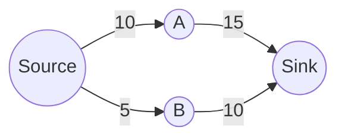

# Simplex Method for the Maximum-Flow Problem (Design and Analysis of Algorithms)

> **Semester Exam Study Guide**
>
> **Topic:** Simplex Method Applied to Maximum-Flow Problem
>
> **Course:** Design and Analysis of Algorithms

---

# Table of Contents

- [1. Introduction](#1-introduction)
- [2. What is the Maximum-Flow Problem?](#2-what-is-the-maximum-flow-problem)
- [3. What is the Simplex Method?](#3-what-is-the-simplex-method)
- [4. Why is the Simplex Method Used?](#4-why-is-the-simplex-method-used)
- [5. When is it Used?](#5-when-is-it-used)
- [6. Where is it Used?](#6-where-is-it-used)
- [7. Mathematical Formulation of Maximum Flow as a Linear Programming Problem](#7-mathematical-formulation-of-maximum-flow-as-a-linear-programming-problem)
- [8. How to Solve Maximum Flow Using the Simplex Method](#8-how-to-solve-maximum-flow-using-the-simplex-method)
- [9. Visual Explanation of the Network](#9-visual-explanation-of-the-network)
- [10. Step-by-Step Execution](#10-step-by-step-execution)
- [11. Example Problem](#11-example-problem)
- [12. Java Implementation](#12-java-implementation)
- [13. Time Complexity](#13-time-complexity)
- [14. Advantages](#14-advantages)
- [15. Limitations and Edge Cases](#15-limitations-and-edge-cases)
- [16. Comparison with Other Maximum Flow Algorithms](#16-comparison-with-other-maximum-flow-algorithms)
- [17. Exam Tips](#17-exam-tips)
- [18. Frequently Asked Questions](#18-frequently-asked-questions)
- [19. Summary](#19-summary)

---

# 1. Introduction

The **Maximum Flow Problem** determines the **largest amount of flow** that can be transported from a **source** node to a **sink** node in a network while satisfying capacity constraints.

Although specialized algorithms like **Ford-Fulkerson** and **Edmonds-Karp** are commonly used, the maximum-flow problem can also be formulated as a **Linear Programming (LP)** problem and solved using the **Simplex Method**.

The Simplex Method is a general optimization technique for solving linear programming problems.

---

# 2. What is the Maximum-Flow Problem?

Given

- Source vertex **S**
- Sink vertex **T**
- Directed graph
- Capacity on every edge

Find the **maximum possible flow** from S to T.

## Example

```text
        10
   S --------> A
   |           |
5  |           |15
   v           v
   B --------> T
        10
```

Goal:

```
Maximize total flow reaching T.
```

---

# 3. What is the Simplex Method?

The **Simplex Method** is an algorithm used to solve **Linear Programming (LP)** problems.

It works by:

- Converting the optimization problem into linear equations
- Moving from one feasible solution to another
- Improving the objective value at every iteration
- Stopping when the optimal solution is reached

---

## General LP Form

Maximize

```
Z = c1x1 + c2x2 + ... + cnxn
```

Subject to

```
Ax ≤ b

x ≥ 0
```

The maximum-flow problem fits perfectly into this framework.

---

# 4. Why is the Simplex Method Used?

Simplex is used because maximum flow is actually a **linear optimization problem**.

It helps when:

- Flow must satisfy multiple constraints
- Additional restrictions exist
- Network optimization combines several objectives
- Researchers solve generalized flow problems

---

## Practical Motivation

Instead of simply finding a path,

Simplex optimizes:

- transportation cost
- production
- shipping
- communication bandwidth
- water distribution

simultaneously.

---

# 5. When is it Used?

Simplex is appropriate when

- Problem is formulated as Linear Programming
- Constraints are linear
- Capacities are known
- Flow conservation is required

---

## Not Recommended When

For ordinary maximum-flow problems,

Prefer

- Ford-Fulkerson
- Edmonds-Karp
- Dinic

because they are much faster.

---

# 6. Where is it Used?

## Telecommunications

Bandwidth allocation

```text
Router A ---> Router B ---> Router C
```

Find maximum data transmission.

---

## Transportation

```text
Factory
   |
Warehouse
   |
Retail Store
```

Maximize shipment quantity.

---

## Water Distribution

```text
Reservoir

↓

Treatment Plant

↓

City
```

---

## Internet Routing

Find maximum packets transmitted.

---

## Electricity Networks

Maximize power transfer.

---

## Airline Scheduling

Optimize passenger movement.

---

## Supply Chains

Move maximum products.

---

## Pipeline Networks

Transport maximum oil or gas.

---

# 7. Mathematical Formulation of Maximum Flow as a Linear Programming Problem

Let

```
xij = flow on edge i → j
```

Objective

```
Maximize

Flow leaving source
```

Subject to

## Capacity Constraints

```
xij ≤ capacity(i,j)
```

---

## Non-negativity

```
xij ≥ 0
```

---

## Flow Conservation

For every intermediate node,

```
Incoming Flow = Outgoing Flow
```

---

Example

```text
A

Incoming = xSA

Outgoing = xAT

Constraint

xSA = xAT
```

---

# 8. How to Solve Maximum Flow Using the Simplex Method

## Step 1

Draw the network.

---

## Step 2

Assign variables.

Example

```
xSA

xSB

xAT

xBT
```

---

## Step 3

Write capacity constraints.

Example

```
xSA ≤ 10

xSB ≤ 5

xAT ≤ 15

xBT ≤ 10
```

---

## Step 4

Write flow conservation equations.

---

## Step 5

Write objective function.

```
Maximize

Z = xAT + xBT
```

---

## Step 6

Convert LP into Simplex tableau.

---

## Step 7

Perform pivot operations.

---

## Step 8

Continue until no further improvement.

---

## Step 9

Read optimal flow.

---

# 9. Visual Explanation of the Network

## Network Diagram



---

## Flow Representation

```text
          10
S ----------------> A
|                  |
|                  |15
5                  |
|                  |
v                  v
B ----------------> T
        10
```

---

## Capacity Table

| Edge | Capacity |
|------|----------|
| S→A | 10 |
| S→B | 5 |
| A→T | 15 |
| B→T | 10 |

---

# 10. Step-by-Step Execution

## Initial Flow

```text
S

↓

0

↓

T
```

---

## First Iteration

```text
S --10--> A
```

Flow

```
10
```

---

## Second Iteration

```text
S --5--> B
```

Flow

```
15
```

---

## Final State

```text
S
|\
| \
|  \
10 5
|   \
v    v
A    B
 \   /
  \ /
   T
```

Maximum Flow

```
15
```

---

# 11. Example Problem

Network

```text
S → A = 10

S → B = 5

A → T = 15

B → T = 10
```

Variables

```
xSA

xSB

xAT

xBT
```

Objective

```
Maximize

xAT + xBT
```

Constraints

```
xSA ≤10

xSB ≤5

xAT ≤15

xBT ≤10

xSA=xAT

xSB=xBT

x≥0
```

Optimal Solution

```
xSA=10

xSB=5

xAT=10

xBT=5

Maximum Flow=15
```

---

# 12. Java Implementation

> **Note:** In practice, maximum flow is usually solved using Ford–Fulkerson or Edmonds–Karp. The code below demonstrates the LP model (for study) and a Simplex implementation for solving LPs.

## A. Linear Programming Model (Concept)

```java
/*
Variables:
xSA, xSB, xAT, xBT

Maximize:
Z = xAT + xBT

Subject to:
xSA <= 10
xSB <= 5
xAT <= 15
xBT <= 10
xSA - xAT = 0
xSB - xBT = 0
x >= 0
*/
```

## B. Simplex Algorithm (Generic Java Implementation)

```java
import java.util.Arrays;

public class Simplex {

    private final double[][] tableau;
    private final int rows;
    private final int cols;

    public Simplex(double[][] tableau) {
        this.tableau = tableau;
        rows = tableau.length;
        cols = tableau[0].length;
    }

    private int getPivotColumn() {
        int pivotCol = 0;
        for (int j = 1; j < cols - 1; j++) {
            if (tableau[rows - 1][j] < tableau[rows - 1][pivotCol]) {
                pivotCol = j;
            }
        }
        return tableau[rows - 1][pivotCol] >= 0 ? -1 : pivotCol;
    }

    private int getPivotRow(int pivotCol) {
        int pivotRow = -1;
        double minRatio = Double.MAX_VALUE;

        for (int i = 0; i < rows - 1; i++) {
            if (tableau[i][pivotCol] > 0) {
                double ratio = tableau[i][cols - 1] / tableau[i][pivotCol];

                if (ratio < minRatio) {
                    minRatio = ratio;
                    pivotRow = i;
                }
            }
        }
        return pivotRow;
    }

    private void pivot(int pivotRow, int pivotCol) {

        double pivotElement = tableau[pivotRow][pivotCol];

        for (int j = 0; j < cols; j++)
            tableau[pivotRow][j] /= pivotElement;

        for (int i = 0; i < rows; i++) {

            if (i != pivotRow) {

                double factor = tableau[i][pivotCol];

                for (int j = 0; j < cols; j++) {
                    tableau[i][j] -= factor * tableau[pivotRow][j];
                }
            }
        }
    }

    public void solve() {

        while (true) {

            int pivotCol = getPivotColumn();

            if (pivotCol == -1)
                break;

            int pivotRow = getPivotRow(pivotCol);

            if (pivotRow == -1) {
                System.out.println("Unbounded Solution");
                return;
            }

            pivot(pivotRow, pivotCol);
        }

        printSolution();
    }

    private void printSolution() {

        System.out.println("Optimal Tableau:");

        for (double[] row : tableau)
            System.out.println(Arrays.toString(row));

        System.out.println("\nOptimal Value = " + tableau[rows - 1][cols - 1]);
    }

    public static void main(String[] args) {

        double[][] tableau = {

                {2,1,1,0,18},
                {2,3,0,1,42},
                {-3,-2,0,0,0}
        };

        Simplex simplex = new Simplex(tableau);

        simplex.solve();
    }
}
```

---

# 13. Time Complexity

Worst-case complexity

```
Exponential
```

Average practical complexity

```
Polynomial-like behavior
```

Although worst-case exponential, Simplex is remarkably efficient for many practical LP problems.

---

# 14. Advantages

- Solves any Linear Programming problem
- Produces optimal solution
- Handles multiple constraints
- Well studied
- Highly accurate
- Used in industrial optimization
- Can solve generalized network flow models

---

# 15. Limitations and Edge Cases

---

## 1. Unbounded Problem

Occurs when the objective can increase indefinitely because constraints do not limit the feasible region.

```text
Objective

↗

↗

↗

No boundary
```

Result

```
No finite optimum.
```

---

## 2. Degenerate Case

Two or more constraints intersect at the same vertex, causing repeated basic feasible solutions.

```text
   *
  ***
 *****
```

Problem

```
Simplex may perform extra iterations without improving the objective.
```

---

## 3. Numerical Instability

Large differences in coefficient magnitudes can lead to floating-point rounding errors.

```text
1

100000000

0.0000001
```

Effect

```
Floating-point errors
```

---

## 4. Performance Bottleneck

Large LPs require many variables and constraints.

```text
Small LP

□ □ □

↓

Fast

------------------

Huge LP

□□□□□□□□□□□□□□

↓

Many iterations
```

---

## 5. Cycling

Rarely, the algorithm can revisit the same basis repeatedly due to degeneracy.

```text
A → B → C
↑       ↓
└───────┘
```

Solution

```
Use Bland's Rule or anti-cycling pivot strategies.
```

---

## 6. Dense Networks

A network with many edges results in a large number of LP variables.

```text
A──B──C
│\/│\/│
│/\│/\│
D──E──F
```

This increases memory usage and computation time.

---

# 16. Comparison with Other Maximum Flow Algorithms

| Algorithm | Technique | Complexity | Best Use |
|-----------|-----------|------------|----------|
| Ford-Fulkerson | Augmenting Paths | O(E × Max Flow) | Small graphs |
| Edmonds-Karp | BFS | O(VE²) | Standard implementation |
| Dinic | Level Graph | O(V²E) (general) | Large sparse networks |
| Push-Relabel | Preflow | O(V³) (worst case) | Dense graphs |
| **Simplex** | Linear Programming | Exponential (worst case) | LP formulations with additional linear constraints |

---

# 17. Exam Tips

Remember these key points:

- Maximum Flow can be formulated as a Linear Programming problem.
- The **objective** is to maximize total flow from source to sink.
- **Capacity constraints** ensure no edge exceeds its capacity.
- **Flow conservation** holds at every intermediate node.
- The **Simplex Method** solves the LP by moving between feasible corner points.
- For ordinary maximum-flow problems, specialized algorithms are generally more efficient than Simplex.
- In theory questions, clearly distinguish between the **LP formulation** and the **Simplex solution process**.

---

# 18. Frequently Asked Questions

### Q1. Can Simplex solve the Maximum-Flow Problem?

**Yes.** Since maximum flow is a linear optimization problem, it can be formulated as a Linear Programming model and solved using the Simplex Method.

---

### Q2. Why don't we always use Simplex?

Because specialized graph algorithms such as **Ford-Fulkerson**, **Edmonds-Karp**, and **Dinic** are typically much faster for pure maximum-flow problems.

---

### Q3. What is the objective function?

To maximize the total flow leaving the source (or equivalently, entering the sink).

---

### Q4. What are the main constraints?

- Capacity constraints
- Flow conservation constraints
- Non-negativity constraints

---

### Q5. Is the Simplex Method guaranteed to find the optimal solution?

Yes, provided the LP is feasible and bounded.

---

# 19. Summary

- **Maximum Flow** finds the largest feasible flow from a source to a sink.
- The problem can be expressed as a **Linear Programming** model.
- The **Simplex Method** solves this LP by iteratively improving feasible solutions.
- Capacity, flow conservation, and non-negativity are the core constraints.
- Although mathematically elegant and flexible, the Simplex Method is usually not the most efficient approach for standard maximum-flow problems.
- Understanding the LP formulation is important for engineering examinations because it connects graph theory with optimization techniques.

---

## One-Minute Revision

| Topic | Key Point |
|--------|-----------|
| Goal | Maximize flow from source to sink |
| Variables | Flow on each directed edge |
| Objective | Maximize total flow |
| Constraints | Capacity, conservation, non-negativity |
| Solution Technique | Simplex Method (Linear Programming) |
| Practical Alternatives | Ford-Fulkerson, Edmonds-Karp, Dinic |
| Common Applications | Networks, transportation, logistics, communication, power systems |
