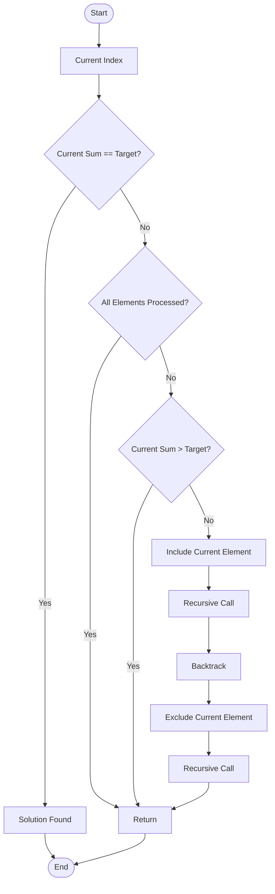

# Backtracking – Subset Sum Problem
### Design and Analysis of Algorithms (DAA) Study Notes

> Comprehensive Engineering Semester Exam Notes

---

# Table of Contents

- [1. Introduction](#1-introduction)
- [2. What is the Subset Sum Problem?](#2-what-is-the-subset-sum-problem)
- [3. Why Study the Subset Sum Problem?](#3-why-study-the-subset-sum-problem)
- [4. When is the Subset Sum Algorithm Used?](#4-when-is-the-subset-sum-algorithm-used)
- [5. Where is the Subset Sum Problem Applied?](#5-where-is-the-subset-sum-problem-applied)
- [6. Mathematical Formulation](#6-mathematical-formulation)
- [7. Understanding Backtracking](#7-understanding-backtracking)
- [8. Why Backtracking Works for Subset Sum](#8-why-backtracking-works-for-subset-sum)
- [9. Basic Algorithm Idea](#9-basic-algorithm-idea)
- [10. Step-by-Step Algorithm](#10-step-by-step-algorithm)
- [11. Backtracking Search Space](#11-backtracking-search-space)
- [12. State Space Tree](#12-state-space-tree)
- [13. Decision Tree Representation](#13-decision-tree-representation)
- [14. Pruning in Backtracking](#14-pruning-in-backtracking)
- [15. Flowchart of the Algorithm](#15-flowchart-of-the-algorithm)

---

# 1. Introduction

The **Subset Sum Problem** is one of the most important problems in **Backtracking**, **Recursion**, **Dynamic Programming**, and **NP-Complete Problems**.

Given a set of integers and a target value, the objective is to determine whether there exists a subset whose sum is exactly equal to the target.

Unlike brute force, **Backtracking intelligently abandons impossible choices**, thereby reducing unnecessary computation.

This problem is frequently asked in:

- Semester examinations
- Coding interviews
- Competitive programming
- GATE
- Placement tests

---

# 2. What is the Subset Sum Problem?

## Definition

Given

```
Set S = {a1, a2, a3, ..., an}

Target = K
```

Determine whether

```
There exists a subset

{ ai , aj , ak ... }

whose sum equals K.
```

---

## Example 1

```
Set

{3, 4, 5, 2}

Target = 9
```

Possible subsets

```
{4,5}

Sum = 9

Answer = YES
```

---

## Example 2

```
Set

{2,4,6}

Target = 5
```

Possible sums

```
2
4
6
2+4=6
2+6=8
4+6=10
2+4+6=12
```

No subset equals 5.

Answer

```
NO
```

---

## Example 3

```
Set

{5,10,12,13,15,18}

Target = 30
```

Solution

```
12 + 18 = 30
```

Answer

```
YES
```

---

# 3. Why Study the Subset Sum Problem?

The Subset Sum Problem demonstrates how recursion can efficiently explore an exponential solution space using intelligent pruning.

It is considered a classical NP-Complete problem because no polynomial-time algorithm is known for the general case.

Understanding this problem helps students learn:

- Recursive thinking
- Decision trees
- State-space search
- Constraint satisfaction
- Pruning strategies
- Optimization techniques
- Dynamic Programming transition

---

## Importance in Algorithms

```
Recursion
      ↓

Backtracking
      ↓

Constraint Satisfaction
      ↓

NP Complete Problems
      ↓

Dynamic Programming
      ↓

Optimization
```

---

# 4. When is the Subset Sum Algorithm Used?

Subset Sum is useful whenever a decision must be made from multiple combinations.

Examples include

- Budget planning
- Project selection
- Task assignment
- Resource allocation
- Package loading
- Knapsack-like problems
- Financial investment planning
- Cryptographic computations

---

## Real-Life Example

Suppose a company has projects costing

```
20
15
35
40
50
```

Budget available

```
75
```

Need to determine

```
Can some projects be selected
whose total cost equals exactly 75?
```

Subset Sum solves this efficiently.

---

# 5. Where is the Subset Sum Problem Applied?

## 1. Cryptography

Many public-key cryptographic systems are based on variants of the subset sum problem.

Example

```
Merkle-Hellman Cryptosystem
```

---

## 2. Resource Allocation

Selecting resources whose combined cost exactly matches available capacity.

```
Servers

CPU
RAM
Storage

Choose resources
whose cost matches budget.
```

---

## 3. Scheduling

Selecting tasks

```
Task A = 2 hours

Task B = 4 hours

Task C = 3 hours

Available Time = 7 hours
```

Need

```
Find tasks totaling exactly 7.
```

---

## 4. Budget Allocation

```
Expenses

200
500
700
900

Budget

1400

Need subset = 1400
```

---

## 5. Inventory Management

Warehouse packing

```
Weights

3
7
10
12

Truck Capacity

22
```

Need

```
Subset = 22
```

---

## 6. Artificial Intelligence

Constraint Satisfaction Problems

Examples

- Planning
- Decision Making
- State Space Search

---

## 7. Cloud Computing

Selecting virtual machines whose costs exactly satisfy the available budget.

---

# 6. Mathematical Formulation

Given

```
S = {a1,a2,a3,...,an}

Target = T
```

Find

```
X ⊆ S
```

such that

```
Σ Xi = T
```

or

```
a1+a4+a6=T
```

---

Mathematically

```
Find

x1,x2,...,xn

where

xi ∈ {0,1}
```

such that

```
a1x1+a2x2+...+anxn=T
```

where

```
0 → element not selected

1 → element selected
```

---

# 7. Understanding Backtracking

Backtracking explores every possible solution recursively.

At every element, there are two choices

```
Include

or

Exclude
```

If a branch cannot produce a valid solution,

```
Stop exploring it

Go Back

Try another branch
```

Hence

```
Backtracking
=
DFS
+
Undo Decisions
+
Pruning
```

---

## General Idea

```
Choose

↓

Explore

↓

If invalid

↓

Undo Choice

↓

Try Next Choice
```

---

# 8. Why Backtracking Works for Subset Sum

Every element has only two possibilities.

```
Take it

OR

Leave it
```

Suppose

```
Set

{3,5,6}
```

Decision tree

```
               {}
            /      \
          3         X
        /   \      / \
      5     X    5   X
```

Eventually

```
Every subset
gets generated.
```

Backtracking ensures

```
Explore

↓

Check

↓

Return

↓

Explore next
```

---

# 9. Basic Algorithm Idea

Suppose

```
Array

{5,10,12}
```

Target

```
17
```

Process

```
Start

↓

Include 5

↓

Need 12

↓

Include 10

↓

Need 2

Impossible

↓

Backtrack

↓

Remove 10

↓

Include 12

↓

5+12=17

Found
```

---

Algorithm Strategy

```
For every element

↓

Include it

↓

Recursive Call

↓

Exclude it

↓

Recursive Call
```

---

# 10. Step-by-Step Algorithm

Assume

```
Set

{2,4,6}

Target

6
```

---

### Step 1

Current Sum

```
0
```

Decision

```
Take 2

or

Skip 2
```

---

### Step 2

If taken

```
Current Sum

2
```

Again

```
Take 4

Skip 4
```

---

### Step 3

If taken

```
2+4=6

Success
```

Stop.

Otherwise

```
Continue recursion.
```

---

General Steps

```
1. Start from first element.

↓

2. Include current element.

↓

3. Recur.

↓

4. Exclude current element.

↓

5. Recur.

↓

6. Continue until

sum == target

OR

all elements processed.
```

---

# 11. Backtracking Search Space

Every element doubles the number of possibilities.

```
n elements

↓

2^n subsets
```

Example

```
n=4

Subsets

0000
0001
0010
0011
0100
0101
0110
0111
1000
1001
1010
1011
1100
1101
1110
1111
```

Total

```
16 subsets
```

---

Visualization

```
Elements

A B C D

Each

Include

Exclude

↓

2×2×2×2

↓

16 possibilities
```

---

# 12. State Space Tree

Example

```
Set

{3,4,5}
```

```
                    {}
                 /      \
               3          X
             /   \      /   \
           4      X    4      X
         /  \   /  \  / \    / \
        5   X 5  X 5  X 5   X
```

Meaning

```
Left

Include

Right

Exclude
```

Every root-to-leaf path represents one subset.

---

# 13. Decision Tree Representation

Example

```
Set

{1,2,3}
```

```
                    {}

             /               \

           {1}                {}

       /        \         /        \

    {1,2}      {1}     {2}        {}

    /   \      / \     / \        / \

{1,2,3}{1,2}{1,3}{1}{2,3}{2}{3}{}
```

Leaf Nodes

```
{1,2,3}

{1,2}

{1,3}

{1}

{2,3}

{2}

{3}

{}
```

These are all possible subsets.

---

# 14. Pruning in Backtracking

One of the biggest advantages of backtracking is **pruning**, which avoids exploring branches that can never produce a valid solution.

## Pruning Rule (Positive Numbers)

If:

```
Current Sum > Target
```

then adding more positive numbers will only increase the sum.

Therefore:

```
Stop exploring this branch.

Return immediately.
```

---

### Example

```
Set

{5,7,10}

Target = 12
```

Tree

```
               0
             /
            5
          /
        12   ✓ Found
       /
     22   ✗ Prune

```

Another branch

```
0
 \
  7
   \
   17

17 > 12

Prune
```

Without pruning, recursion continues unnecessarily.

With pruning

```
Large parts
of the tree
are skipped.
```

---

## Advantages of Pruning

```
Reduces recursion

↓

Reduces execution time

↓

Avoids unnecessary exploration

↓

Improves efficiency
```

---

# 15. Flowchart of the Algorithm



---

## Key Points to Remember

- Each element has **two choices**: Include or Exclude.
- A recursion tree represents the exploration of all subsets.
- Pruning avoids unnecessary recursive calls when the current sum already exceeds the target (for positive integers).
- In the worst case, the algorithm explores **2ⁿ** subsets.
- The algorithm follows the **Depth-First Search (DFS)** strategy with backtracking.
- Every leaf node in the decision tree represents one possible subset.

---

---

# 16. Complete Recursion Tree

Consider the following example.

```
Set = {5, 10, 12}

Target = 17
```

Each element has two possibilities.

- Include
- Exclude

Hence every recursive call branches into two more calls.

---

## Complete State Space Tree

```
                                   {}
                             (Sum = 0)

                    / Include 5          \ Exclude 5

               {5} (5)                     {} (0)

          /Inc10      \Exc10         /Inc10      \Exc10

      {5,10}(15)      {5}(5)      {10}(10)      {}(0)

      /     \         /    \        /    \        /    \

 +12 /       \ -12 +12      -12  +12    -12   +12     -12

{5,10,12} {5,10} {5,12} {5} {10,12} {10} {12} {}

 27         15      17     5    22      10     12    0
```

---

### Result

```
Subset

{5,12}

Sum

17

Target Achieved
```

---

# 17. Understanding Each Recursive Call

At every recursion level we answer one question.

```
Should I include this element?
```

There are only two answers.

```
YES

or

NO
```

Example

```
Array

5 10 12
```

Decision sequence

```
Level 1

5 ?

YES

↓

Level 2

10 ?

NO

↓

Level 3

12 ?

YES

↓

5+12=17
```

Solution found.

---

# 18. Step-by-Step Dry Run

Example

```
Array

{3,4,5}

Target = 9
```

---

Initial State

```
Current Sum = 0

Current Index = 0
```

---

### Call 1

```
Choose 3

Sum = 3
```

Now recurse.

---

### Call 2

```
Choose 4

Sum = 7
```

Again recurse.

---

### Call 3

```
Choose 5

Sum = 12
```

```
12 > 9

Invalid

Backtrack
```

Tree

```
3

↓

7

↓

12

Backtrack
```

---

Remove 5

```
Current Sum

7
```

Nothing left.

Return.

---

Backtrack again

Remove 4.

```
Current Sum

3
```

Now skip 4.

Choose 5.

```
3+5

=

8
```

Not target.

Return.

---

Remove 3.

Current Sum

```
0
```

Choose 4.

```
Sum

4
```

Choose 5.

```
4+5

=

9

Success
```

Answer

```
Subset

{4,5}
```

---

# 19. Backtracking Visualization

Backtracking always follows this cycle.

```
Choose

↓

Explore

↓

Fail?

↓

Undo Choice

↓

Choose Another
```

Visual

```
            Choose 5

                |

                V

           Current Sum=5

                |

                V

           Choose 10

                |

                V

         Current Sum=15

                |

                V

          Choose 12

                |

                V

          Current Sum=27

                |

           27>17

                |

          BACKTRACK

                |

          Remove 12

                |

           Try Next
```

---

# 20. Include-Exclude Principle

Every recursive call performs two operations.

```
Include

Exclude
```

Example

```
Element

7
```

Decision

```
            7

         /     \

Include     Exclude
```

Every future element repeats this.

---

Example

```
1

         /      \

        2        X

      /  \      /  \

     3   X     3    X
```

Number of leaves

```
2³

=

8
```

---

# 21. Complete Search Space

Suppose

```
Array

{1,2,3,4}
```

All subsets

```
{}

{1}

{2}

{3}

{4}

{1,2}

{1,3}

{1,4}

{2,3}

{2,4}

{3,4}

{1,2,3}

{1,2,4}

{1,3,4}

{2,3,4}

{1,2,3,4}
```

Total

```
16 subsets
```

---

Tree

```
                    {}

              /             \

            1               X

         /      \       /       \

       2        X      2         X

      / \      / \    / \       / \

     3  X     3  X   3  X      3  X

    / \        ... continues ...
```

---

# 22. Detailed Backtracking Process

Imagine recursion as walking inside a maze.

```
Enter

↓

Choose path

↓

Dead end?

↓

Return

↓

Choose another path
```

Subset Sum works exactly like this.

Example

```
Target = 15

Array

5 8 12
```

```
Take 5

↓

Take 8

↓

Sum=13

↓

Take12

↓

25

Too large

↓

Return

↓

Remove12

↓

Return

↓

Remove8

↓

Take12

↓

17

Too large

↓

Return

↓

Remove12

↓

Remove5
```

Now

```
Take8

↓

Take12

↓

20

Return
```

Algorithm finishes.

---

# 23. Visualization of Recursive Stack

Whenever recursion happens,

functions are stored inside the stack.

Example

```
subset(0,0)

↓

subset(1,5)

↓

subset(2,15)

↓

subset(3,27)
```

Stack

```
---------------------

subset(3,27)

---------------------

subset(2,15)

---------------------

subset(1,5)

---------------------

subset(0,0)

---------------------
```

Now

```
27>17

Return
```

Stack becomes

```
---------------------

subset(2,15)

---------------------

subset(1,5)

---------------------

subset(0,0)

---------------------
```

This is called

```
Backtracking
```

---

# 24. Backtracking Animation (ASCII)

```
Start

↓

{}

↓

Choose A

↓

{A}

↓

Choose B

↓

{A,B}

↓

Fail

↓

Remove B

↓

{A}

↓

Choose C

↓

{A,C}

↓

Success
```

---

Another visualization

```
                 Root

              /       \

          Include     Exclude

             |

          Include

             |

         Invalid

             |

       BACKTRACK

             |

          Exclude

             |

        Continue
```

---

# 25. Decision Table

Example

```
Array

{2,4,6}

Target=6
```

| Decision | Current Subset | Sum | Action |
|----------|----------------|-----|--------|
| Start | {} | 0 | Continue |
| Include 2 | {2} | 2 | Continue |
| Include 4 | {2,4} | 6 | Success |
| Exclude 4 | {2} | 2 | Continue |
| Include 6 | {2,6} | 8 | Prune |
| Exclude 2 | {} | 0 | Continue |
| Include 4 | {4} | 4 | Continue |
| Include 6 | {4,6} | 10 | Prune |
| Exclude 4 | {} | 0 | Continue |
| Include 6 | {6} | 6 | Success |

---

# 26. Recursive Function Execution Order

The recursive calls occur in **Depth First Search (DFS)** order.

Example

```
subset(0)

↓

subset(1)

↓

subset(2)

↓

subset(3)

↓

Return

↓

subset(3)

↓

Return

↓

subset(2)

↓

...
```

Visualization

```
            Root

             |

             V

            Left

             |

             V

         Left Child

             |

             V

       Deepest Node

             |

        Return ↑

             |

       Explore Right
```

---

# 27. Important Observations

## Observation 1

Every element has exactly **two** choices.

```
Include

Exclude
```

---

## Observation 2

The recursion tree is a **binary tree**.

```
Every node

↓

2 children
```

---

## Observation 3

Number of subsets

```
2ⁿ
```

where

```
n

=

Number of elements
```

---

## Observation 4

Each leaf node represents one subset.

Example

```
Leaf

{4,5}

Leaf

{3}

Leaf

{}
```

---

## Observation 5

Pruning saves computation by avoiding impossible branches.

```
Current Sum > Target

↓

Stop recursion
```

---

# 28. Key Exam Points

- Backtracking uses recursion with **include/exclude** decisions.
- The state-space tree is a **binary decision tree**.
- Every recursive call either **selects** or **rejects** the current element.
- Every leaf node corresponds to a unique subset.
- For positive integers, pruning occurs when the current sum exceeds the target.
- The recursion follows **Depth-First Search (DFS)**.
- Worst-case exploration still examines **2ⁿ subsets**.

---

**End of Part 2**

**Next Part:** Complete Java implementation with detailed comments, algorithm explanation, complexity analysis, correctness proof, and execution trace.

---

# 29. Java Implementation (Backtracking)

The following implementation determines whether there exists a subset whose sum equals the target value.

```java
import java.util.*;

public class SubsetSumBacktracking {

    // Recursive function
    static boolean subsetSum(int[] arr, int index, int currentSum, int target) {

        // Base Case 1: Target achieved
        if (currentSum == target) {
            return true;
        }

        // Base Case 2: End of array
        if (index == arr.length) {
            return false;
        }

        // Pruning (Valid only when all numbers are positive)
        if (currentSum > target) {
            return false;
        }

        // Include current element
        if (subsetSum(arr, index + 1,
                      currentSum + arr[index],
                      target)) {
            return true;
        }

        // Exclude current element
        return subsetSum(arr,
                         index + 1,
                         currentSum,
                         target);
    }

    public static void main(String[] args) {

        int[] arr = {5, 10, 12, 13, 15, 18};
        int target = 30;

        if (subsetSum(arr, 0, 0, target))
            System.out.println("Subset Exists");
        else
            System.out.println("Subset Does Not Exist");
    }
}
```

---

# 30. Output

```
Subset Exists
```

Because

```
12 + 18 = 30
```

---

# 31. Code Explanation

## Recursive Function

```java
subsetSum(arr,index,currentSum,target)
```

Parameters

| Parameter | Meaning |
|-----------|----------|
| arr | Input array |
| index | Current element |
| currentSum | Sum so far |
| target | Desired sum |

---

## Base Case 1

```java
if(currentSum==target)
```

Meaning

```
Required subset found.

Stop recursion.

Return true.
```

---

## Base Case 2

```java
if(index==arr.length)
```

Meaning

```
All elements checked.

No solution.

Return false.
```

---

## Pruning

```java
if(currentSum>target)
```

Applicable only for

```
Positive Numbers
```

because adding more positive numbers can never decrease the sum.

---

## Include Step

```java
currentSum+arr[index]
```

Meaning

```
Take current element.
```

---

## Exclude Step

```java
currentSum
```

Meaning

```
Ignore current element.
```

---

# 32. Improved Version (Print the Subset)

```java
import java.util.*;

public class SubsetSumPrint {

    static boolean subset(int[] arr,
                          int index,
                          int target,
                          int sum,
                          ArrayList<Integer> ans) {

        if (sum == target) {
            System.out.println(ans);
            return true;
        }

        if (index == arr.length)
            return false;

        if (sum > target)
            return false;

        // Include
        ans.add(arr[index]);

        if (subset(arr,
                   index + 1,
                   target,
                   sum + arr[index],
                   ans))
            return true;

        // Backtrack
        ans.remove(ans.size() - 1);

        // Exclude
        return subset(arr,
                      index + 1,
                      target,
                      sum,
                      ans);
    }

    public static void main(String args[]) {

        int arr[] = {5,10,12,13,15,18};

        ArrayList<Integer> answer = new ArrayList<>();

        subset(arr,
               0,
               30,
               0,
               answer);

    }
}
```

---

## Output

```
[12, 18]
```

---

# 33. How Backtracking Happens in Code

Suppose

```
Current subset

[5,10]
```

Now include

```
12
```

Subset becomes

```
[5,10,12]
```

Suppose it fails.

Backtracking performs

```java
ans.remove(ans.size()-1);
```

Subset becomes

```
[5,10]
```

Now recursion explores

```
Without 12
```

Visualization

```
Add 12

↓

[5,10,12]

↓

Fail

↓

Remove 12

↓

[5,10]
```

---

# 34. Execution Trace

Example

```
Array

5 10 12

Target

17
```

Recursive calls

```
subset(0,0)

↓

subset(1,5)

↓

subset(2,15)

↓

subset(3,27)

Return

↓

subset(3,15)

Return

↓

subset(2,5)

↓

subset(3,17)

Success
```

---

# 35. Call Stack Diagram

```
Top

subset(3,17)

subset(2,5)

subset(1,5)

subset(0,0)

Bottom
```

After success

```
Stack Pops

↓

subset(2,5)

↓

subset(1,5)

↓

subset(0,0)
```

---

# 36. Algorithm (Pseudocode)

```
Subset(index,sum)

if sum==target

    return TRUE

if index==n

    return FALSE

if sum>target

    return FALSE

Include current element

if recursive call returns TRUE

      return TRUE

Exclude current element

return recursive call
```

---

# 37. Formal Algorithm

```
Algorithm SUBSETSUM

Input

Array A

Target T

Output

True if subset exists

False otherwise

------------------------------------------------

Subset(index,sum)

1.

If sum=T

Return TRUE

2.

If index=n

Return FALSE

3.

If sum>T

Return FALSE

4.

Include current element

5.

Recursive Call

6.

If TRUE

Return TRUE

7.

Exclude current element

8.

Recursive Call

9.

Return result
```

---

# 38. Correctness Proof (Informal)

At every recursive call, the algorithm considers **both possible decisions** for the current element:

- Include it.
- Exclude it.

Since every element is processed exactly once with both choices, the recursion generates **every possible subset**.

If a subset with the required target exists, one recursive path will eventually reach

```
currentSum == target
```

and return `true`.

If no subset satisfies the condition, all possible subsets are explored and the algorithm returns `false`.

Therefore, the algorithm is correct.

---

# 39. Complexity Analysis

## Time Complexity

Each element has two choices.

```
Include

Exclude
```

Therefore

```
T(n)=2×T(n-1)+O(1)
```

Expanding

```
=2(2T(n−2))

=4T(n−2)

=8T(n−3)

...

=2ⁿ
```

Hence

```
Time Complexity

O(2ⁿ)
```

---

### Tree Visualization

```
Level 0

1 node

Level 1

2 nodes

Level 2

4 nodes

Level 3

8 nodes

...

Level n

2ⁿ nodes
```

Total work

```
≈2ⁿ
```

---

## Space Complexity

The recursion depth equals the number of elements.

```
Maximum recursion depth

=

n
```

Therefore

```
Space Complexity

O(n)
```

because of the recursive call stack.

---

## Complexity Summary

| Operation | Complexity |
|-----------|------------|
| Time | **O(2ⁿ)** |
| Recursive Stack | **O(n)** |
| Auxiliary Space | **O(n)** |
| Number of Subsets | **2ⁿ** |

---

# 40. Advantages of Backtracking Solution

- Simple recursive implementation.
- Generates all subsets systematically.
- Easy to understand.
- Uses DFS traversal.
- Can terminate immediately after finding a solution.
- Pruning reduces unnecessary recursive calls for positive integers.
- Useful for many constraint satisfaction problems.

---

# 41. Disadvantages

- Exponential running time.
- Not suitable for very large input sizes.
- Recursive overhead.
- Performance degrades rapidly as `n` increases.
- Pruning is limited when negative numbers are present.

---

# 42. Comparison with Brute Force

| Feature | Brute Force | Backtracking |
|----------|-------------|--------------|
| Generates all subsets | Yes | Yes |
| Recursive | No (or optional) | Yes |
| Pruning | No | Yes |
| Early termination | Difficult | Easy |
| Faster in practice | No | Often Yes |
| Worst-case complexity | O(2ⁿ) | O(2ⁿ) |

---

# 43. Comparison with Dynamic Programming

| Feature | Backtracking | Dynamic Programming |
|----------|--------------|---------------------|
| Finds one solution quickly | Yes | Not necessarily |
| Explores recursively | Yes | No |
| Stores intermediate results | No | Yes |
| Uses memoization | No | Yes |
| Time Complexity | O(2ⁿ) | O(n × Target) |
| Space Complexity | O(n) | O(n × Target) |
| Suitable for large targets | No | Better |

---

# 44. Key Exam Points

- Backtracking follows the **Include/Exclude** strategy.
- Every recursive call creates two branches.
- The recursion tree is a binary tree.
- Worst-case time complexity is **O(2ⁿ)**.
- Recursive stack space is **O(n)**.
- Pruning is valid only when all remaining elements are non-negative (commonly positive).
- Dynamic Programming is preferred for repeated subproblems and larger instances.

---

**End of Part 3**

**Next Part:** Edge cases, limitations, optimizations, visual examples for special cases, applications, viva questions, MCQs, interview questions, and final exam revision summary.

---

# 45. Edge Cases

A good implementation should correctly handle all special cases. Understanding these is important for semester exams and interviews.

---

## Edge Case 1: Empty Set

Input

```
Set = {}

Target = 10
```

Visualization

```
          {}

No elements

↓

No subset
```

Output

```
False
```

---

## Edge Case 2: Empty Set with Target = 0

Input

```
Set = {}

Target = 0
```

Visualization

```
Empty subset

{}

Sum = 0
```

Output

```
True
```

Reason

The empty subset itself has sum 0.

---

## Edge Case 3: Target is Zero

Example

```
Set

{5,8,10}

Target

0
```

Tree

```
Start

↓

Current Sum = 0

↓

Target Found
```

Output

```
True
```

The algorithm should terminate immediately.

---

## Edge Case 4: Single Element Equals Target

```
Set

{15}

Target

15
```

Visualization

```
        {}

       /

     {15}

Sum = 15

Success
```

Output

```
True
```

---

## Edge Case 5: Single Element Not Equal Target

```
Set

{20}

Target

15
```

Visualization

```
Take 20

↓

20 ≠ 15

↓

Return
```

Output

```
False
```

---

## Edge Case 6: All Elements Larger Than Target

Example

```
Set

20 25 30

Target

10
```

Visualization

```
20

↓

20>10

Prune
```

Every branch gets pruned immediately.

Output

```
False
```

---

## Edge Case 7: Duplicate Elements

Example

```
Set

5 5 5

Target

10
```

Possible solutions

```
First + Second

First + Third

Second + Third
```

Visualization

```
          {}

        /     \

      5         X

    /  \

   5    X

Target = 10
```

Output

```
True
```

Duplicates should be treated as separate elements if they occur at different indices.

---

## Edge Case 8: Negative Numbers

Example

```
Set

5 -3 8

Target

2
```

Possible subset

```
5 + (-3)

=

2
```

Problem

Pruning rule

```
Current Sum > Target

Return
```

becomes incorrect.

Example

```
Current Sum

5

↓

Later

+(-3)

↓

2
```

If we had pruned at 5, we would miss the correct answer.

Therefore

```
Never use

sum>target

pruning

when negative numbers exist.
```

---

## Edge Case 9: Multiple Valid Solutions

```
Set

2 3 5 7

Target

10
```

Solutions

```
3+7

2+3+5
```

Visualization

```
Tree

↓

Two leaves

↓

Target Found
```

Depending on implementation

```
Return first solution

OR

Print all solutions
```

---

## Edge Case 10: Large Input Size

Example

```
40 elements
```

Possible subsets

```
2^40

≈

1 Trillion
```

Visualization

```
n

↓

2^n

↓

Huge tree

↓

Slow
```

Backtracking becomes impractical.

---

# 46. Limitations of Backtracking

Although backtracking is elegant, it has several limitations.

---

## Limitation 1: Exponential Time

```
n

↓

2^n subsets
```

Example

```
n=30

↓

1,073,741,824 subsets
```

This makes execution slow.

---

## Limitation 2: Deep Recursion

Visualization

```
Call1

↓

Call2

↓

Call3

↓

...

↓

Call1000
```

Large recursion depth may cause

```
Stack Overflow
```

---

## Limitation 3: Repeated Computation

Tree

```
Root

↓

Branch A

↓

Sum=15

Root

↓

Branch B

↓

Sum=15
```

Same state may be computed multiple times.

Dynamic Programming avoids this using memoization.

---

## Limitation 4: Negative Numbers

Pruning

```
Current Sum > Target
```

cannot be used safely.

Hence more branches must be explored.

---

## Limitation 5: Large Target Values

Even if

```
Target

=

100000
```

the recursion still explores exponentially many subsets.

---

# 47. Optimizations

Several optimizations improve practical performance.

---

## Optimization 1: Sorting

Sort the array before recursion.

```
Before

10 3 8 1

↓

After

1 3 8 10
```

Benefits

- Better pruning
- Smaller search tree
- Faster discovery of solutions

---

## Optimization 2: Branch and Bound

Estimate whether a branch can still reach the target.

Visualization

```
Current Sum

15

Remaining Sum

5

Target

40

15+5

<40

Impossible

↓

Prune
```

---

## Optimization 3: Dynamic Programming

Instead of exploring recursively,

store previously computed states.

```
(sum,index)

↓

Already solved

↓

Reuse answer
```

---

## Optimization 4: Memoization

Cache recursive calls.

Example

```
(index=4,sum=17)

↓

Already visited

↓

Return cached value
```

---

# 48. Applications

---

## 1. Cryptography

Subset Sum forms the basis of several historical cryptographic systems.

```
Secret Key

↓

Subset Sum

↓

Encryption
```

---

## 2. Resource Allocation

Choose resources matching a fixed budget.

Example

```
Memory Blocks

10

15

20

Target

35
```

Solution

```
15+20
```

---

## 3. Budget Planning

```
Expenses

100

200

350

500

Target

650
```

Possible solution

```
150? (No)

150 absent

Instead

150 unavailable

350+200+100=650
```

---

## 4. Project Selection

Projects

```
A

B

C

D
```

Budget

```
40 Lakhs
```

Need

```
Best subset
```

---

## 5. Task Scheduling

Tasks

```
2 hr

3 hr

5 hr
```

Available time

```
8 hr
```

Solution

```
3+5
```

---

## 6. Warehouse Packing

```
Boxes

5

8

10

12

Capacity

20
```

Subset

```
8+12
```

---

## 7. Artificial Intelligence

Used in

- Constraint Satisfaction Problems
- Planning
- Search
- Decision Making

---

## 8. Operations Research

Useful in

- Manufacturing
- Logistics
- Production scheduling
- Capacity planning

---

# 49. Frequently Asked Viva Questions

### Q1. What is the Subset Sum Problem?

Finding whether a subset of numbers adds exactly to a target value.

---

### Q2. Which paradigm solves it here?

```
Backtracking
```

---

### Q3. Why is recursion used?

To systematically generate all subsets.

---

### Q4. How many subsets exist?

```
2^n
```

---

### Q5. Why is pruning possible?

When all remaining numbers are non-negative and the current sum already exceeds the target.

---

### Q6. Worst-case Time Complexity?

```
O(2^n)
```

---

### Q7. Space Complexity?

```
O(n)
```

---

### Q8. Which traversal is used?

```
Depth First Search
```

---

### Q9. Can negative numbers affect pruning?

Yes. They invalidate the simple `sum > target` pruning rule.

---

### Q10. Difference between Backtracking and Dynamic Programming?

Backtracking explores possibilities recursively, whereas Dynamic Programming stores and reuses solutions to overlapping subproblems.

---

# 50. Multiple Choice Questions

### 1.

Subset Sum using Backtracking follows

- A. BFS
- B. DFS
- C. Greedy
- D. Divide and Conquer

**Answer**

```
B
```

---

### 2.

Worst-case complexity

- A. O(log n)
- B. O(n)
- C. O(n²)
- D. O(2ⁿ)

**Answer**

```
D
```

---

### 3.

Each recursive call creates

- A. One branch
- B. Two branches
- C. Three branches
- D. Four branches

**Answer**

```
B
```

---

### 4.

Backtracking mainly uses

- A. Queue
- B. Stack (Recursion)
- C. Heap
- D. Graph

**Answer**

```
B
```

---

### 5.

Subset Sum is a

- A. Sorting Problem
- B. Searching Problem
- C. Decision Problem
- D. Hashing Problem

**Answer**

```
C
```

---

# 51. Interview Questions

1. Explain the Include–Exclude strategy.
2. Draw the state-space tree for `{2,3,5}`.
3. Why is Subset Sum NP-Complete?
4. Why does backtracking use DFS?
5. How is pruning performed?
6. Why does pruning fail with negative numbers?
7. Compare Backtracking with Dynamic Programming.
8. How can all valid subsets be printed?
9. How would you optimize the algorithm?
10. What are the practical applications of Subset Sum?

---

# 52. Exam Revision Sheet

## Definition

```
Find whether a subset exists
whose sum equals target.
```

---

## Strategy

```
Include

Exclude

↓

Recursion

↓

Backtracking
```

---

## State Space

```
Binary Tree
```

---

## Number of Subsets

```
2^n
```

---

## Traversal

```
Depth First Search
```

---

## Base Cases

```
sum==target

Return true

----------------

index==n

Return false
```

---

## Pruning Rule

```
sum>target

↓

Return
```

**Applicable only for non-negative (typically positive) numbers.**

---

## Time Complexity

```
O(2^n)
```

---

## Space Complexity

```
O(n)
```

---

## Advantages

- Easy to implement.
- Natural recursive formulation.
- Can stop early after finding a solution.
- Effective pruning for positive inputs.
- Suitable for constraint satisfaction problems.

---

## Disadvantages

- Exponential running time.
- Deep recursion.
- Repeated computations.
- Poor scalability for large `n`.
- Simple pruning fails with negative numbers.

---

# 53. Summary

The **Subset Sum Problem** is one of the classical applications of **Backtracking**. The algorithm explores the solution space using an **Include/Exclude** decision at each element, forming a binary state-space tree. Through recursion and backtracking, it systematically checks every possible subset while pruning impossible branches when appropriate.

### Final Takeaways

- Every element has **two choices**: Include or Exclude.
- The recursion tree contains **2ⁿ possible subsets**.
- Backtracking uses **Depth-First Search (DFS)**.
- Worst-case **Time Complexity = O(2ⁿ)**.
- **Space Complexity = O(n)** due to recursion.
- Pruning significantly improves practical performance for arrays containing only non-negative values.
- Dynamic Programming is generally preferred when overlapping subproblems and large inputs make exponential search impractical.

---

# Quick Memory Formula

```text
Subset Sum

        ↓

Include / Exclude

        ↓

Recursion

        ↓

Backtracking

        ↓

DFS

        ↓

2ⁿ Subsets

        ↓

Time = O(2ⁿ)

Space = O(n)
```

---

**End of Document**
**End of Part 1**

**Next Part:** Complete recursion trees, detailed dry run, backtracking visualization, and step-by-step execution with multiple examples.
